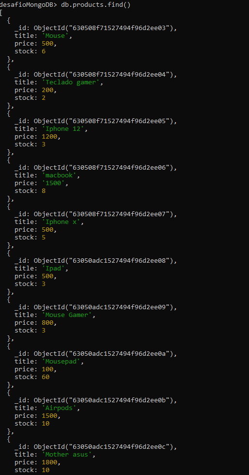
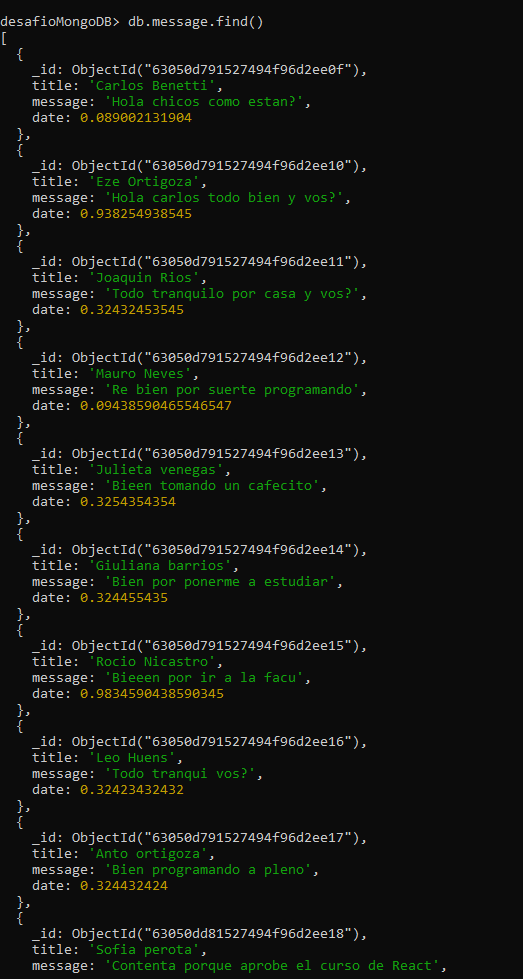
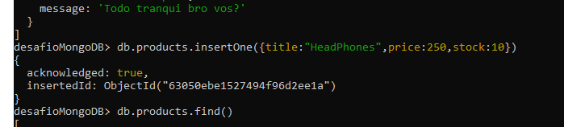
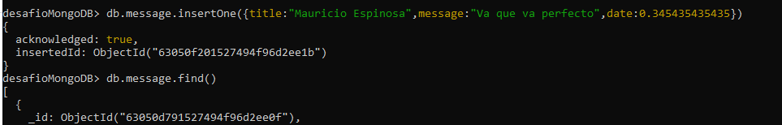

# Listar documentos en cada coleccion
command: desafioMongoDB> db.products.find()

command: desafioMongoDB> db.message.find()

# Mostrar la cantidad de documentos almacenados en cada una de ellas:

CRUD

#Agregar un producto mas en cada coleccion:

# Listar los productos con precios menores a 600 pesos:

# Listar los productos con precios entre 600 y 900 pesos:

# Listar los Productos con precioes mayores a 800 pesos:

# Realizar una consulta que traiga solo el nombre del septimo producto mas barato:

# Hacer una actualizacion sobre todos los productos, modificando el campo stock a todos ellos con un valor de 100:

# Cambiar el stock a 0 de los productos con precios mayores a 700 pesos:

# Borrar los productos con precio menor a 600 pesos:

